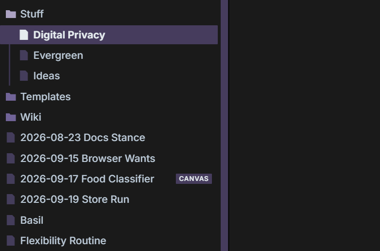

---

# Prepend Creation Date

This is a simple Obsidian plugin that makes it easy to date notes in your Obsidian Vault.

Run it from the file explorer or command palette!

## Features

- Batch Editing
- Command Palette & Files Support